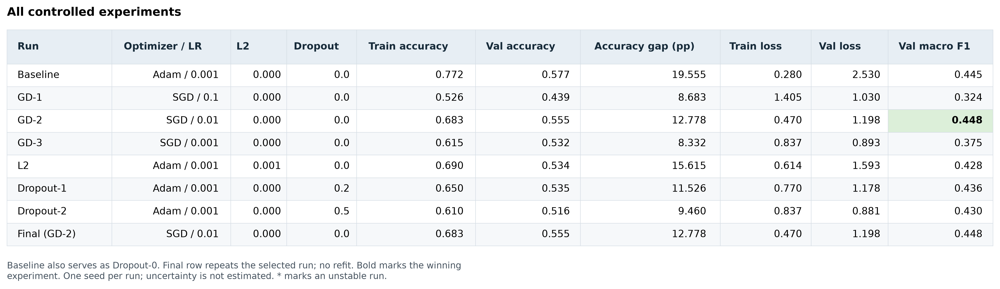
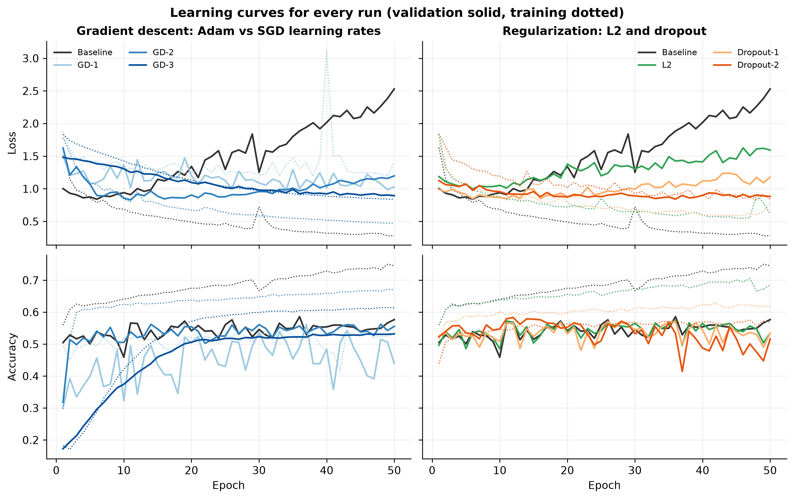
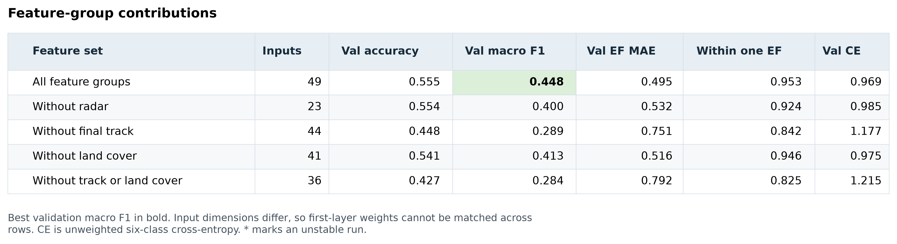

\vspace*{1in}
\begin{center}
\textbf{Meteorological Indicators, Exposure, and EF Rating\\in U.S. Tornadoes, 2010-2025}

\vspace{0.5in}
Jake Van Slyke

University of Oklahoma

September 16, 2026
\end{center}

\newpage

# 1. Problem and Dataset

This project asks how learning rate and regularization affect a deep neural network's ability to classify tornado EF ratings. It also asks which information helps explain the recorded rating. An EF rating comes from surveyed damage and estimated wind speeds, so predicting it does not mean measuring the tornado's actual wind speed (National Weather Service, n.d.). That distinction matters when some of the inputs come from the same event records as the label.

My previous project used location, timing, and path dimensions to classify tornadoes as EF0, EF1, or EF2+. It ended with two proposed next steps: evaluate across time and add land use along the track (Van Slyke, 2026). This project follows those directions using a linked compilation of tornado records, nearby radar indicators, archived warnings, and land-cover summaries. However, the earlier test accuracy of 0.613 is not a benchmark for this model. The years, inputs, class definitions, and split all changed.

The pinned US Tornado Data, 2010-2025 release contains 20,164 records (Van Slyke, n.d.). I excluded 1,525 unknown ratings, leaving 18,639 labeled events, and retained all six categories, EF0 through EF5. The split contains 11,771 training events from 2010-2019, 3,117 validation events from 2020-2022, and 3,751 test events from 2023-2025. No source-linkage group crosses these boundaries. This gives a direct test of transfer to later years while keeping linked records together.

The classes are very uneven. There are 9,197 EF0 events but only eight EF5 events, split 7/0/1 across training, validation, and test. Keeping EF5 separate preserves the target's meaning, but it cannot provide a dependable EF5 performance estimate. Radar coverage is also incomplete: some onset maxima are missing for about two thirds of records. I kept those events and added missingness indicators because an absent detection is not necessarily a failed download. Unknown ratings were never treated as EF0.

\newpage

# 2. Model Design

The network receives 49 inputs from location, timing, radar, warnings, final track, and land cover. I encode time cyclically, log-transform skewed predictors, and add missingness indicators. Imputation, scaling, and the choice of log transforms use only training data.

The baseline has three hidden Dense layers of 128, 64, and 32 ReLU units and a six-unit softmax output, for 16,934 trainable parameters. I used TensorFlow/Keras, Adam at 0.001, and sparse categorical cross-entropy with inverse-frequency class weights. Each run uses seed 42, batches of 64, and 50 epochs. The weights give an EF5 row about 902 times an EF0 row's influence without creating more rare-event evidence.

# 3. Experiments

I compared SGD at 0.1, 0.01, and 0.001, then added L2 or dropout separately to the Adam baseline. Preprocessing, split, seeds, and training budget stayed fixed. Table 1 repeats the selected model in its final row.

\begin{reportcaption}
\textbf{Table 1}\\
\textit{Final-epoch results for the controlled experiments}
\end{reportcaption}

{width=100%}

\begin{reportcaption}
\textit{Note.} Accuracy is evaluated after fitting, with dropout disabled. Loss is the class-weighted training objective and includes any L2 penalty on both splits. The baseline also supplies the dropout-0 comparison.
\end{reportcaption}

SGD subtracts the learning rate times the batch gradient from each weight. SGD 0.01 reached 0.50 validation accuracy first among SGD runs, at epoch 2. A rate of 0.1 was erratic; 0.001 was still improving at epoch 50.

\newpage

## Overfitting and regularization

The baseline overfits clearly in Figure 1. Validation loss reaches 0.84 at epoch 6, then climbs to 2.53 while training loss falls to 0.28. SGD 0.01 ends at 1.20 validation loss. Adam still has slightly higher validation accuracy, so the preferred model depends on the metric.

\begin{reportcaption}
\textbf{Figure 1}\\
\textit{Training and validation curves for all seven experiments}
\end{reportcaption}

\noindent {width=100%}

L2 penalizes large weights (Keras, n.d.-b). Adding 0.001 to the hidden layers reduces the accuracy gap from 19.6 to 15.6 points, but validation macro F1 falls from 0.445 to 0.428. Dropout masks activations during training and uses all units during evaluation (Keras, n.d.-a). I placed it after the first two hidden layers. Rates of 0.2 and 0.5 reduce the gap to 11.5 and 9.5 points. Training accuracy can fall because masking makes fitting harder, even when validation loss improves.

Dropout 0.5 gives lower validation loss than 0.2, but lower accuracy, 0.516 versus 0.535. Its macro F1 is also lower, 0.430 versus 0.436. It reduces the loss gap, but neither dropout run improves F1 over the baseline. These differences remain unconfirmed across seeds.

\newpage

# 4. Results and Evaluation

SGD 0.01, or GD-2, won on validation macro F1 at 0.448. I used macro F1 because EF0 and EF1 dominate accuracy. Selection uses the final epoch, with validation loss as the tie-breaker, preserving a comparable budget and leaving late overfitting visible.

I reused GD-2's trained weights for the final test evaluation. It reached 0.537 accuracy against 0.387 for always predicting EF0, the training-majority class. Unweighted test cross-entropy was 1.072, and six-class macro F1 was 0.343. About 92.9% of predictions fell within one EF category, with a mean absolute error of 0.541 categories.

\begin{reportcaption}
\textbf{Figure 2}\\
\textit{Final-model confusion matrix and per-class test metrics}
\end{reportcaption}

\noindent {width=100%}

Figure 2 shows why accuracy alone is insufficient. EF3 recall is 0.50, but precision is only 0.19. The model finds seven of the eleven EF4 events, yet EF4 precision is 0.16. It detects some severe events while also calling many weaker events severe. The single EF5 event was predicted as EF4.

Validation macro F1 covers five classes because it contains no EF5. Test macro F1 excluding EF5 is 0.412, compared with 0.448 in validation, explaining part of the apparent drop. EF1 becomes the largest test class at 47.1%, but the remaining difference cannot be assigned to drift alone.

\newpage

# 5. Analysis and Interpretation

Regularization improved the loss curves much more than classification. I expected a smaller training-validation gap to mean a better model, but dropout 0.5 reduced that gap while lowering macro F1 from 0.445 to 0.430. Loss evaluates probabilities; F1 evaluates the selected classes. Those measures can move differently, and lower loss alone does not establish better calibration.

I then retrained GD-2 after removing feature groups, using validation results only. Table 2 shows that final-track information contributes most: removing it lowers macro F1 from 0.448 to 0.289. Removing radar gives 0.400; removing land cover gives 0.413.

\begin{reportcaption}
\textbf{Table 2}\\
\textit{Validation performance after removing feature groups}
\end{reportcaption}

{width=100%}

Land cover adds little macro F1 once track is removed. This does not settle the earlier rural-under-rating hypothesis. Land cover is an exposure proxy, and track dimensions share information with the damage-based target. The models measure predictive associations rather than causal effects or actual wind intensity. The run without track and land cover still includes full-window radar, so it is not an onset-only forecast.

The strongest limits are one seed, one temporal split, sparse severe classes, incomplete radar data, and prior inspection of the test years. With another week, I would seek richer storm-environment and exposure data, then revisit ordinal classification and other approaches to class imbalance. EF ratings are ordered; the question is whether patterns across neighboring ratings can help the model learn from rare severe events. Earlier ordinal and ensemble trials did not establish a robust gain. I would compare methods across seeds and reserve independent later events for evaluation. For now, SGD 0.01 and final-track information give the strongest results.

\newpage

# References

\reference{Keras. (n.d.-a). \emph{Dropout layer}. \url{https://keras.io/api/layers/regularization_layers/dropout/}}

\reference{Keras. (n.d.-b). \emph{Layer weight regularizers}. \url{https://keras.io/api/layers/regularizers/}}

\reference{National Weather Service. (n.d.). \emph{The Enhanced Fujita scale (EF scale)}. \url{https://www.weather.gov/oun/efscale}}

\reference{Van Slyke, J. (n.d.). \emph{US tornado data, 2010-2025} (Version 2.2.1, Kaggle version 8) [Data set]. Kaggle. \url{https://www.kaggle.com/datasets/jakevanslyke/us-tornado-data-2010-2025/versions/8}}

\reference{Van Slyke, J. (2026). \emph{Tornado severity classification with a neural network in TensorFlow} [Unpublished course report]. University of Oklahoma.}
