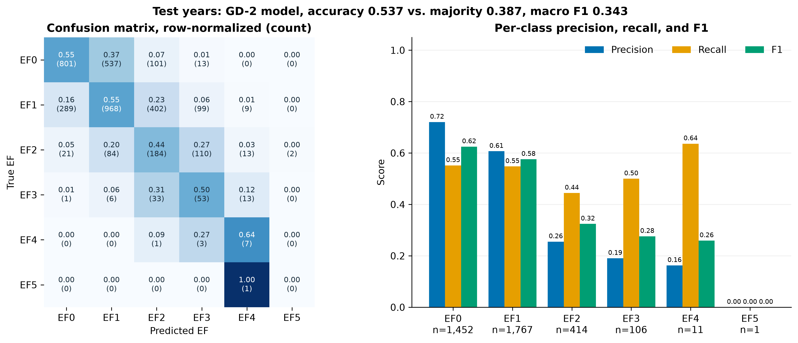

<!-- _class: title -->
<!-- _paginate: false -->

# Learning rate, regularization, and tornado EF ratings

Jake Van Slyke
University of Oklahoma

<!--
About 15 seconds.
I used the tornado project to ask how learning rate and regularization change a deep network's behavior. I also wanted to see which kinds of information help explain the recorded rating.
-->

---

# Data and experiment design

**18,639 rated tornadoes**, 2010–2025. Six classes: EF0–EF5.

| Training | Validation | Test |
|---|---|---|
| 2010–2019 | 2020–2022 | 2023–2025 |
| 11,771 events | 3,117 events | 3,751 events |

Three hidden layers: **128, 64, 32**. Same seed and 50 epochs.

Compare **SGD learning rates, L2, and dropout**.

<small>EF describes surveyed damage. Inputs include radar, warnings, final track, and land cover.</small>

<!--
About 40 seconds.
The previous project used a random split. Here I train on earlier years and evaluate on later ones. I keep all six EF categories, although EF5 has only eight events. Preprocessing is fit on training data, and I keep the split and seed fixed across experiments. Final track information makes this a retrospective analysis.
Sources: notebook.ipynb, Table 1 and Table 3; dataset version 8, https://www.kaggle.com/datasets/jakevanslyke/us-tornado-data-2010-2025/versions/8; EF scale, https://www.weather.gov/oun/efscale.
-->

---

# SGD at 0.01 gave the best macro F1

| Run | Validation accuracy | Validation macro F1 |
|---|---:|---:|
| Adam, 0.001 | 0.577 | 0.445 |
| SGD, 0.1 | 0.439 | 0.324 |
| **SGD, 0.01** | **0.555** | **0.448** |
| SGD, 0.001 | 0.532 | 0.375 |

**0.1 was erratic.** At 0.001, learning was still slow after 50 epochs.

<small>Final-epoch validation results. Macro F1 covers the five classes present in validation.</small>

<!--
About 40 seconds.
SGD changes each weight by subtracting the learning rate times the batch gradient. Too large a step made learning erratic. The smallest rate was still improving when the budget ended. Among the SGD runs, 0.01 reached 50 percent validation accuracy first, at epoch two. Adam was faster at that threshold, but 0.01 had the best final macro F1. I chose macro F1 because EF0 and EF1 dominate accuracy.
Source: data/results/table_04_training_experiments.csv and training_history.csv.
-->

---

# My “aha”: a smaller gap did not mean better F1

| Adam run | Accuracy gap¹ | Validation loss | Macro F1 |
|---|---:|---:|---:|
| Baseline | 19.6 pp | 2.53 | 0.445 |
| L2, 0.001 | 15.6 pp | 1.59 | 0.428 |
| Dropout, 0.2 | 11.5 pp | 1.18 | 0.436 |
| Dropout, 0.5 | 9.5 pp | 0.88 | 0.430 |

Dropout 0.5 reduced the gap, but lowered validation accuracy.

<small>¹Training minus validation accuracy, evaluated with dropout off. Loss includes class weights and any L2 penalty.</small>

<!--
About 45 seconds.
I expected regularization to help because the baseline overfits so clearly. Its validation loss bottoms out at epoch six and then rises while training loss falls. Dropout and L2 reduce that gap, but all three regularized runs have lower F1 than the baseline. The important distinction is that loss evaluates probabilities while F1 evaluates the chosen classes. Dropout 0.5 is useful for the loss curve but too aggressive if I only care about accuracy. One seed does not establish that the small F1 differences are reliable.
Sources: notebook.ipynb, Figure 3 and Table 4; Keras regularizers, https://keras.io/api/layers/regularizers/; dropout, https://keras.io/api/layers/regularization_layers/dropout/.
-->

---

<!-- _class: figure -->

# Test results: low precision for severe ratings

<small>SGD 0.01 on 3,751 later events. Test loss: 1.072. Six-class macro F1: 0.343.</small>

<!--
About 45 seconds.
Accuracy is 53.7 percent, compared with 38.7 percent for always predicting the training-majority class. The model finds some severe events, but precision is low: only about 19 percent of its EF3 predictions are correct. There is only one EF5 event, and it calls that EF4. Validation F1 averages five classes and test F1 averages six. Excluding EF5, test macro F1 is 0.412. So part of the apparent drop comes from the averaging convention.
Source: notebook.ipynb, Figure 5 and Table 5. Image is the notebook's saved test result.
-->

---

# Final-track information contributed most

| Features removed | Validation macro F1 |
|---|---:|
| None | **0.448** |
| Radar | 0.400 |
| Final track | **0.289** |
| Land cover | 0.413 |
| Final track and land cover | 0.284 |

Track dimensions share information with the damage-based rating.

<small>Same split and training settings. Validation comparisons only.</small>

<!--
About 40 seconds.
I retrained the selected model without each feature group. Removing track produces the largest drop. Radar and land cover also help in the full model, but land cover adds little once track is gone. This does not prove rural under-rating or measure true wind intensity. The model without track and land cover still includes radar after onset. These are predictive associations, and different input dimensions also change the first-layer initialization.
Source: data/results/table_06_feature_groups.csv.
-->

---

<!-- _class: question -->

# What remains unclear

**Can patterns across EF ratings help us learn from rare severe events?**

- Add **richer data** on storm conditions and exposure.
- Revisit **ordinal models** and other methods for class imbalance.
- Compare across seeds, then evaluate on independent later events.

<small>EF5 support is only 7/0/1 across train/validation/test. Earlier ordinal and ensemble trials have not established a robust gain.</small>

<!--
About 40 seconds. Total target: approximately 4 minutes 25 seconds.
Severe tornadoes are rare, but EF categories have an order. I want to test whether patterns across that order can help the model learn about the rare cases. With another week, I would seek richer storm and exposure data, revisit ordinal classification, and compare other ways of handling imbalance, such as different sampling or ensemble methods. Earlier trials did not establish a robust gain. I would compare across seeds and use independent later events because these test years have already been inspected. The aim is better severe-event detection without simply overpredicting severity. These remain damage ratings, not direct wind measurements.
Sources: notebook.ipynb, Table 1 and Section 7; notes.md development history.
-->
